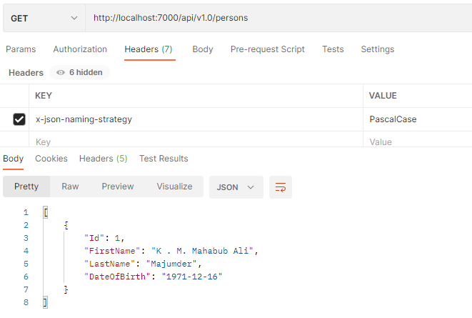
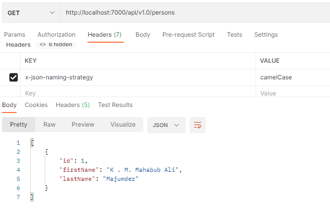
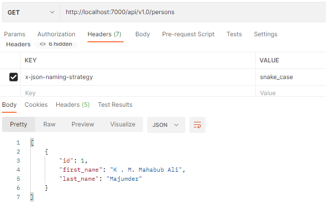
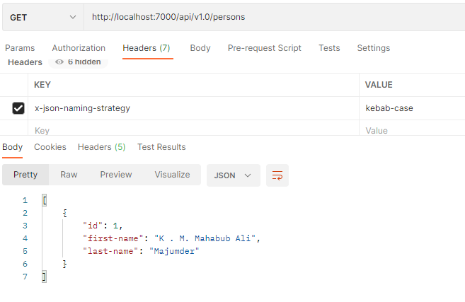

# Dynamic naming strategy for JSON Serialization in ASP.NET Core

There are several naming convensions are used for JSON. It is best practice to use one naming convension all over the application. But sometimes when we integrate third-party APIs then we can't follow single naming convension because the third-party APIs might follow different naming convension.

e.g:
```JSON
{
    "lastName": "Majumder"
}
```

```JSON
{
    "last_name": "Majumder"
}
```

`camelCase` and `snake_case` are widely used but for third-party integration both might be mixed in single solution.

This situation can be overcome in ASP.NET Core using custom contract resolver. Client can send request header `x-json-naming-strategy` and get the desire output.  

Valid values for `x-json-naming-strategy` header are `PascalCase`, `camelCase`, `snack_case` and `kebab-case`.

If header not sent then `camelCase` will be used as default naming strategy.

<br />

# Dependencies

* Newtonsoft.Json
* IHttpContextAccessor
* IMemoryCache

<br />

# Setup

## Configure `DynamicContractResolver` with default SerializerSettings

```C#
services.AddHttpContextAccessor(); // IHttpContextAccessor
services.AddMemoryCache(); // IMemoryCache

services.AddControllers()
        .AddDynamicContractResolver();
```

## Configure `DynamicContractResolver` with customize SerializerSettings

```C#
services.AddHttpContextAccessor(); // IHttpContextAccessor
services.AddMemoryCache(); // IMemoryCache

services.AddControllers()
        .AddDynamicContractResolver(options =>
        {
            options.SerializerSettings.NullValueHandling = NullValueHandling.Ignore;
            options.SerializerSettings.DefaultValueHandling = DefaultValueHandling.Ignore;
            options.SerializerSettings.ReferenceLoopHandling = ReferenceLoopHandling.Ignore;
        });
```

## Resolve dependencies

```C#
app.UseDynamicContractResolver();
```
This will resolve all the required dependencies.

<br />

> ***Note:*** It is not recommended to resolve dependencies using `services.BuildServiceProvider()` 
```C#
services.BuildServiceProvider().GetService<IMemoryCache>()
```

`ASP0000: Do not call 'IServiceCollection.BuildServiceProvider' in 'ConfigureServices'`

<br />

## Complete configuration

```C#
public void ConfigureServices(IServiceCollection services)
{
    services.AddHttpContextAccessor(); // IHttpContextAccessor
    services.AddMemoryCache(); // IMemoryCache

    services.AddControllers()
            .AddDynamicContractResolver();

    // rest of configurations
}
```

```C#
public void Configure(IApplicationBuilder app, IWebHostEnvironment env)
{
    app.UseDynamicContractResolver();

    // rest of configurations
}
```

<br />

# Output

# PascalCase naming strategy


<br />

# camelCase naming strategy


<br />

# snack_case naming strategy



<br />

# kebab-case naming strategy

